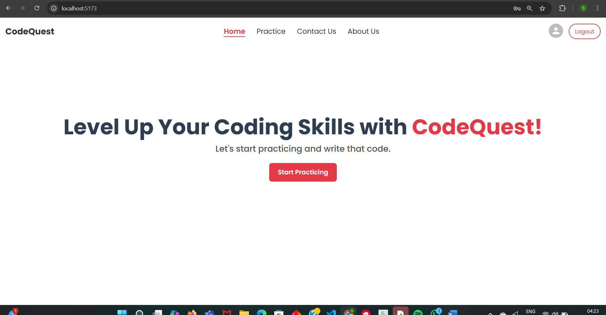
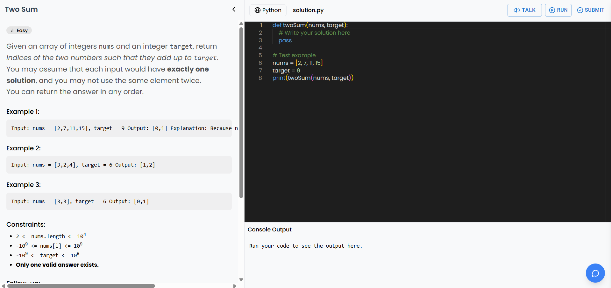
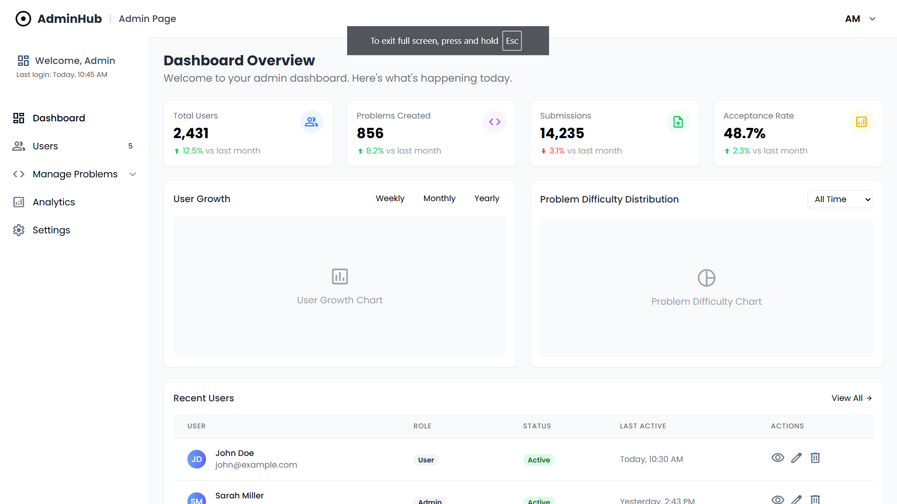

# 🚀 CodeQuest

**CodeQuest** is an interactive coding platform built with the **PERN Stack** (PostgreSQL, Express, React, Node.js), designed to help users practice coding problems, get real-time AI assistance, run and submit code, and explore detailed analytics. It’s a complete solution for learning, practicing, and mastering coding challenges.

---

## 🧠 Features

- 🧩 **Problem Solving**: Browse, attempt, and solve coding challenges.
- 🧠 **AI Assistant**: Get help with problems via a guided AI-powered chatbot.
- 🖥️ **Code Editor**: Language-selectable Monaco editor with syntax highlighting and theme support.
- ⚙️ **Code Execution**: Submit and run code against test cases in real-time (Python).
- 📊 **Submission Analytics**: View accepted/rejected runs and performance statistics.
- 🗣️ **Voice Support**: Integrated Speech-to-Text and Text-to-Speech (Web Speech API).
- 🛠️ **Admin Panel**: Manage problems, users, submissions, and usage analytics securely.

---
## 📸 Screenshots

---
## 🛠️ Tech Stack

| Layer       | Technology                   |
|------------|------------------------------|
| Frontend   | React, Tailwind CSS, Material UI |
| Backend    | Node.js, Express              |
| Database   | PostgreSQL                    |
| AI Support | Google Gemini API / OpenAI API|
| Auth       | JWT-based Auth                |
| Others     | Web Speech API, Toastify, Framer Motion |

---

🔗 Live Demo

🌐 Try it here: https://codequest-sskx.onrender.com/
